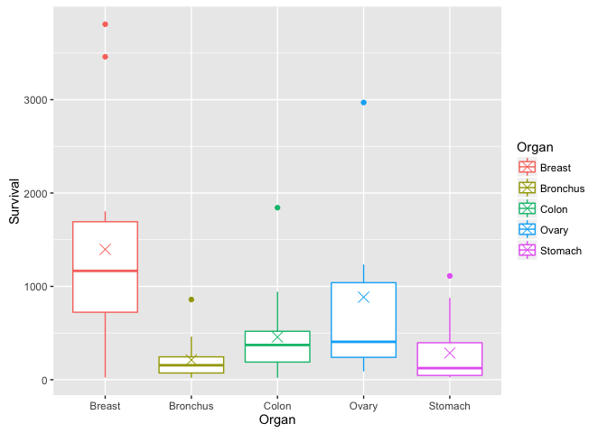
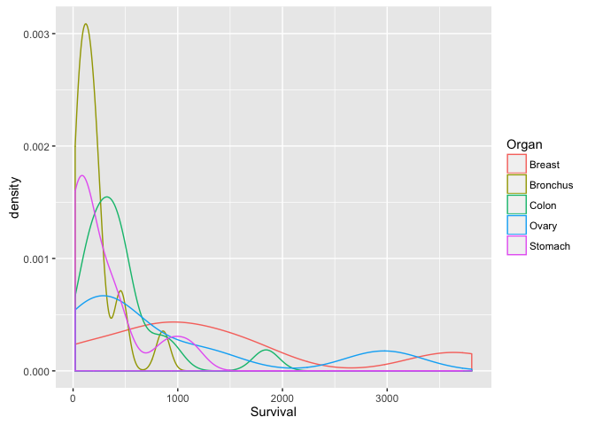
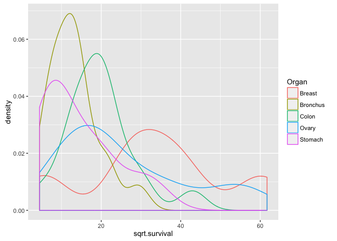
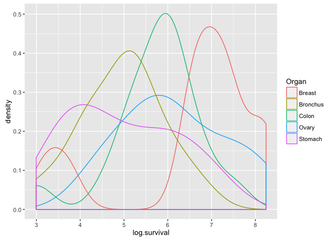
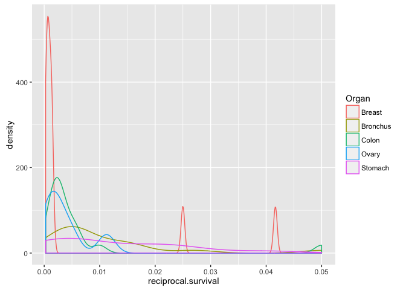
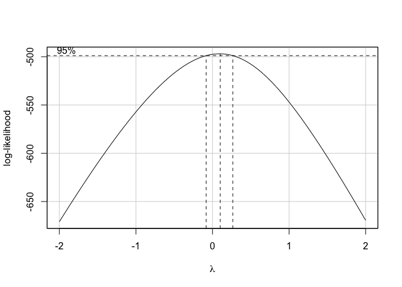

# One Way Analysis of Variance Exercises
Danilo Ascione  
10/17/2016  


Exercises from http://r-exercises.com/2016/09/30/one-way-analysis-of-variance-exercises/

##Introduction
"For this exercise we will use data on patients having stomach, colon, ovary, bronchus, or breast cancer. The objective of the study was to identify if the number of days a patient survived was influenced by the organ affected. Our dependent variable is Survival measured in days. Our independent variable is Organ. The data is available here http://lib.stat.cmu.edu/DASL/Datafiles/CancerSurvival.html"

We want to find out if there is a statistical difference in the mean of five groups of cancers.

Since we have more than two groups we cannot use the t test, so we use the ANOVA method instead.

For the ANOVA results to be valid, the following assumptions need to be satisfied:

1. The dependent variable is required to be continuous
2. The independent variable is required to be categorical with or more categories.
3. The dependent and independent variables have values for each row of data.
4. Observations in each group are independent.
5. The dependent variable is approximately normally distributed in each group.
6. There is approximate equality of variance in all the groups.
7. We should not have any outliers

Our dependent variable is Survival measured in days and it is continuous, so the first assumption is satisfied. 

Our independent variable is Organ: stomach, colon, ovary, bronchus, or breast. It is a categorical variable and thus also the second assumption is satisfied.

## Exercise 1

Load the data into R


```r
cancer_survival <- read.csv("cancer-survival.csv", header = TRUE)
```

## Exercise 2

Create summary statistics for each organ


```r
by(cancer_survival, cancer_survival$Organ, describe)
```

```
## cancer_survival$Organ: Breast
##          vars  n    mean      sd median trimmed    mad min  max range skew
## Survival    1 11 1395.91 1238.97   1166 1280.33 662.72  24 3808  3784 0.81
## Organ*      2 11    1.00    0.00      1    1.00   0.00   1    1     0  NaN
##          kurtosis     se
## Survival     -0.7 373.56
## Organ*        NaN   0.00
## -------------------------------------------------------- 
## cancer_survival$Organ: Bronchus
##          vars  n   mean     sd median trimmed    mad min max range skew
## Survival    1 17 211.59 209.86    155   181.2 133.43  20 859   839 1.75
## Organ*      2 17   2.00   0.00      2     2.0   0.00   2   2     0  NaN
##          kurtosis   se
## Survival     2.66 50.9
## Organ*        NaN  0.0
## -------------------------------------------------------- 
## cancer_survival$Organ: Colon
##          vars  n   mean     sd median trimmed    mad min  max range skew
## Survival    1 17 457.41 427.17    372   394.2 244.63  20 1843  1823 1.96
## Organ*      2 17   3.00   0.00      3     3.0   0.00   3    3     0  NaN
##          kurtosis    se
## Survival     3.76 103.6
## Organ*        NaN   0.0
## -------------------------------------------------------- 
## cancer_survival$Organ: Ovary
##          vars n   mean      sd median trimmed    mad min  max range skew
## Survival    1 6 884.33 1098.58    406  884.33 386.96  89 2970  2881 1.01
## Organ*      2 6   4.00    0.00      4    4.00   0.00   4    4     0  NaN
##          kurtosis     se
## Survival    -0.75 448.49
## Organ*        NaN   0.00
## -------------------------------------------------------- 
## cancer_survival$Organ: Stomach
##          vars  n mean     sd median trimmed    mad min  max range skew
## Survival    1 13  286 346.31    124  234.64 121.57  25 1112  1087 1.27
## Organ*      2 13    5   0.00      5    5.00   0.00   5    5     0  NaN
##          kurtosis    se
## Survival     0.25 96.05
## Organ*        NaN  0.00
```

```r
describeBy(cancer_survival, cancer_survival$Organ)
```

```
## $Breast
##          vars  n    mean      sd median trimmed    mad min  max range skew
## Survival    1 11 1395.91 1238.97   1166 1280.33 662.72  24 3808  3784 0.81
## Organ*      2 11    1.00    0.00      1    1.00   0.00   1    1     0  NaN
##          kurtosis     se
## Survival     -0.7 373.56
## Organ*        NaN   0.00
## 
## $Bronchus
##          vars  n   mean     sd median trimmed    mad min max range skew
## Survival    1 17 211.59 209.86    155   181.2 133.43  20 859   839 1.75
## Organ*      2 17   2.00   0.00      2     2.0   0.00   2   2     0  NaN
##          kurtosis   se
## Survival     2.66 50.9
## Organ*        NaN  0.0
## 
## $Colon
##          vars  n   mean     sd median trimmed    mad min  max range skew
## Survival    1 17 457.41 427.17    372   394.2 244.63  20 1843  1823 1.96
## Organ*      2 17   3.00   0.00      3     3.0   0.00   3    3     0  NaN
##          kurtosis    se
## Survival     3.76 103.6
## Organ*        NaN   0.0
## 
## $Ovary
##          vars n   mean      sd median trimmed    mad min  max range skew
## Survival    1 6 884.33 1098.58    406  884.33 386.96  89 2970  2881 1.01
## Organ*      2 6   4.00    0.00      4    4.00   0.00   4    4     0  NaN
##          kurtosis     se
## Survival    -0.75 448.49
## Organ*        NaN   0.00
## 
## $Stomach
##          vars  n mean     sd median trimmed    mad min  max range skew
## Survival    1 13  286 346.31    124  234.64 121.57  25 1112  1087 1.27
## Organ*      2 13    5   0.00      5    5.00   0.00   5    5     0  NaN
##          kurtosis    se
## Survival     0.25 96.05
## Organ*        NaN  0.00
## 
## attr(,"call")
## by.data.frame(data = x, INDICES = group, FUN = describe, type = type)
```

There are values for each row of data in both the Survival and Organ variables. The third assumption is satisfied. Since each observation represents a different patient, the fourth assumption is also satisfied. 

## Exercise 3

Check if we have any outliers using boxplot

<!-- -->

There is at least one outlier in each group, so the seventh assumption is not satisfied.

### Exercise 4

Check for normality using Shapiro.wilk test


```
## $Breast
## 
## 	Shapiro-Wilk normality test
## 
## data:  X[[i]]
## W = 0.86857, p-value = 0.07431
## 
## 
## $Bronchus
## 
## 	Shapiro-Wilk normality test
## 
## data:  X[[i]]
## W = 0.76596, p-value = 0.0007186
## 
## 
## $Colon
## 
## 	Shapiro-Wilk normality test
## 
## data:  X[[i]]
## W = 0.76056, p-value = 0.0006134
## 
## 
## $Ovary
## 
## 	Shapiro-Wilk normality test
## 
## data:  X[[i]]
## W = 0.76688, p-value = 0.029
## 
## 
## $Stomach
## 
## 	Shapiro-Wilk normality test
## 
## data:  X[[i]]
## W = 0.75473, p-value = 0.002075
```

<!-- -->

Only for the breast cancer group we cannot reject the hypothesis that the dependent variable is normally distributed (p-value = 0.07431 > 0.05). The fifth assumption is not satisfied.

### Exercise 5

Check for equality of variance

Since the data shows non-normality, the Levene's Test is a good candidate for checking the equality of variance. 


```
## Levene's Test for Homogeneity of Variance (center = median)
##       Df F value   Pr(>F)   
## group  4  4.4524 0.003271 **
##       59                    
## ---
## Signif. codes:  0 '***' 0.001 '**' 0.01 '*' 0.05 '.' 0.1 ' ' 1
```

The resulting p-value is 0.003271 thus, the null hypothesis of equal variances is rejected, i.e. there is a difference between the variances. The sixth assumption is not satisfied.

### Exercise 6

Transform your data and check for normality and equality of variance.

First try with a square root transformation of data.


```r
#Tranform data (square root)
cancer_survival$sqrt.survival <- sqrt(cancer_survival$Survival)
#Check for normality
with(cancer_survival,tapply(sqrt.survival, Organ,shapiro.test))
```

```
## $Breast
## 
## 	Shapiro-Wilk normality test
## 
## data:  X[[i]]
## W = 0.9388, p-value = 0.5065
## 
## 
## $Bronchus
## 
## 	Shapiro-Wilk normality test
## 
## data:  X[[i]]
## W = 0.92042, p-value = 0.1501
## 
## 
## $Colon
## 
## 	Shapiro-Wilk normality test
## 
## data:  X[[i]]
## W = 0.93801, p-value = 0.2953
## 
## 
## $Ovary
## 
## 	Shapiro-Wilk normality test
## 
## data:  X[[i]]
## W = 0.89084, p-value = 0.3226
## 
## 
## $Stomach
## 
## 	Shapiro-Wilk normality test
## 
## data:  X[[i]]
## W = 0.86185, p-value = 0.04076
```

```r
ggplot(cancer_survival, aes(sqrt.survival, colour=Organ)) + geom_density()
```

<!-- -->

```r
#Check for equality of variance
leveneTest(cancer_survival$sqrt.survival, cancer_survival$Organ)
```

```
## Levene's Test for Homogeneity of Variance (center = median)
##       Df F value  Pr(>F)  
## group  4   2.664 0.04114 *
##       59                  
## ---
## Signif. codes:  0 '***' 0.001 '**' 0.01 '*' 0.05 '.' 0.1 ' ' 1
```

Shapiro-Wilk's test p-value for Stomach is <0.05
Levene's Test is <0.05, thus the equal variances hypothesis is rejected.


```r
#Tranform data (log)
cancer_survival$log.survival <- log(cancer_survival$Survival)
#Check for normality
with(cancer_survival,tapply(log.survival, Organ,shapiro.test))
```

```
## $Breast
## 
## 	Shapiro-Wilk normality test
## 
## data:  X[[i]]
## W = 0.802, p-value = 0.009995
## 
## 
## $Bronchus
## 
## 	Shapiro-Wilk normality test
## 
## data:  X[[i]]
## W = 0.98047, p-value = 0.9613
## 
## 
## $Colon
## 
## 	Shapiro-Wilk normality test
## 
## data:  X[[i]]
## W = 0.92636, p-value = 0.1891
## 
## 
## $Ovary
## 
## 	Shapiro-Wilk normality test
## 
## data:  X[[i]]
## W = 0.983, p-value = 0.9655
## 
## 
## $Stomach
## 
## 	Shapiro-Wilk normality test
## 
## data:  X[[i]]
## W = 0.92837, p-value = 0.3245
```

```r
ggplot(cancer_survival, aes(log.survival, colour=Organ)) + geom_density()
```

<!-- -->

```r
#Check for equality of variance
leveneTest(cancer_survival$log.survival, cancer_survival$Organ)
```

```
## Levene's Test for Homogeneity of Variance (center = median)
##       Df F value Pr(>F)
## group  4  0.6685 0.6164
##       59
```
Shapiro-Wilk's test p-value for Breast is < 0.05 (Breast group is not normal distribuited)
Levene's Test p-value is >0.05, the equal variances hypothesis is not rejected 


```r
#Tranform data (reciprocal transformation)
cancer_survival$reciprocal.survival <- 1/cancer_survival$Survival
#Check for normality
with(cancer_survival,tapply(reciprocal.survival, Organ,shapiro.test))
```

```
## $Breast
## 
## 	Shapiro-Wilk normality test
## 
## data:  X[[i]]
## W = 0.53771, p-value = 4.345e-06
## 
## 
## $Bronchus
## 
## 	Shapiro-Wilk normality test
## 
## data:  X[[i]]
## W = 0.70991, p-value = 0.0001501
## 
## 
## $Colon
## 
## 	Shapiro-Wilk normality test
## 
## data:  X[[i]]
## W = 0.42861, p-value = 3.399e-07
## 
## 
## $Ovary
## 
## 	Shapiro-Wilk normality test
## 
## data:  X[[i]]
## W = 0.83505, p-value = 0.1186
## 
## 
## $Stomach
## 
## 	Shapiro-Wilk normality test
## 
## data:  X[[i]]
## W = 0.85828, p-value = 0.03656
```

```r
ggplot(cancer_survival, aes(reciprocal.survival, colour=Organ)) + geom_density()
```

<!-- -->

```r
#Check for equality of variance
leveneTest(cancer_survival$reciprocal.survival, cancer_survival$Organ)
```

```
## Levene's Test for Homogeneity of Variance (center = median)
##       Df F value Pr(>F)
## group  4  0.6022 0.6626
##       59
```
Breast, bronchus, colon and stomach groups are not normal distribuited
Levene's Test p-value is >0.05

Turns out that an ln is a good transformation, as confirmed by a Box-Cox linearity plot of our data:

```r
boxCox(Survival ~ Organ, data= cancer_survival)
```

```
## Warning in plot.window(...): "data" is not a graphical parameter
```

```
## Warning in plot.xy(xy, type, ...): "data" is not a graphical parameter
```

```
## Warning in axis(side = side, at = at, labels = labels, ...): "data" is not
## a graphical parameter

## Warning in axis(side = side, at = at, labels = labels, ...): "data" is not
## a graphical parameter
```

```
## Warning in box(...): "data" is not a graphical parameter
```

```
## Warning in title(...): "data" is not a graphical parameter
```

<!-- -->

Unfortunately the fifth assumption is still not satisfied since the Breast group is not normal distribuited after the log transformation.

### Exercise 7

Run one way ANOVA test


```r
summary(aov(log.survival ~ Organ, data = cancer_survival))
```

```
##             Df Sum Sq Mean Sq F value  Pr(>F)   
## Organ        4  24.49   6.122   4.286 0.00412 **
## Residuals   59  84.27   1.428                   
## ---
## Signif. codes:  0 '***' 0.001 '**' 0.01 '*' 0.05 '.' 0.1 ' ' 1
```

The p-value is less than 0.05, thus we reject the null hypothesis of equal means for all cancer groups.


```r
pairwise.t.test(cancer_survival$log.survival, cancer_survival$Organ, p.adjust.method = "bonferroni")
```

```
## 
## 	Pairwise comparisons using t tests with pooled SD 
## 
## data:  cancer_survival$log.survival and cancer_survival$Organ 
## 
##          Breast Bronchus Colon  Ovary 
## Bronchus 0.0097 -        -      -     
## Colon    0.8525 0.5695   -      -     
## Ovary    1.0000 0.3911   1.0000 -     
## Stomach  0.0191 1.0000   0.8120 0.4955
## 
## P value adjustment method: bonferroni
```

Ovary-Breast, Ovary-Colon and Stomach-Bronchus pairs have similar means.

### Exercise 8

Perform a Tukey HSD post hoc test


```r
TukeyHSD(aov(log.survival ~ Organ, data = cancer_survival), conf.level = 0.95)
```

```
##   Tukey multiple comparisons of means
##     95% family-wise confidence level
## 
## Fit: aov(formula = log.survival ~ Organ, data = cancer_survival)
## 
## $Organ
##                         diff       lwr        upr     p adj
## Bronchus-Breast  -1.60543320 -2.906741 -0.3041254 0.0083352
## Colon-Breast     -0.80948110 -2.110789  0.4918267 0.4119156
## Ovary-Breast     -0.40798703 -2.114754  1.2987803 0.9615409
## Stomach-Breast   -1.59068365 -2.968399 -0.2129685 0.0158132
## Colon-Bronchus    0.79595210 -0.357534  1.9494382 0.3072938
## Ovary-Bronchus    1.19744617 -0.399483  2.7943753 0.2296079
## Stomach-Bronchus  0.01474955 -1.224293  1.2537924 0.9999997
## Ovary-Colon       0.40149407 -1.195435  1.9984232 0.9540004
## Stomach-Colon    -0.78120255 -2.020245  0.4578403 0.3981146
## Stomach-Ovary    -1.18269662 -2.842480  0.4770864 0.2763506
```

Ovary-Breast, Stomach-Bronchus and Ovary-Colon means are very similar, a confirmation of the results obtained with the pairwise t test using the Bonferroni correction.

### Exercise 9

Interpret results

Interpretation after each exercise.

### Exercise 10

Use a Kruskal-Wallis test


```r
kruskal.test(log.survival~Organ, data=cancer_survival)
```

```
## 
## 	Kruskal-Wallis rank sum test
## 
## data:  log.survival by Organ
## Kruskal-Wallis chi-squared = 14.954, df = 4, p-value = 0.004798
```

With such a small p-value resulting from the Krustal-Wallis test, the null hypothesis that the medians of all cancer groups are equal is rejected. This is consistent with previous results.
